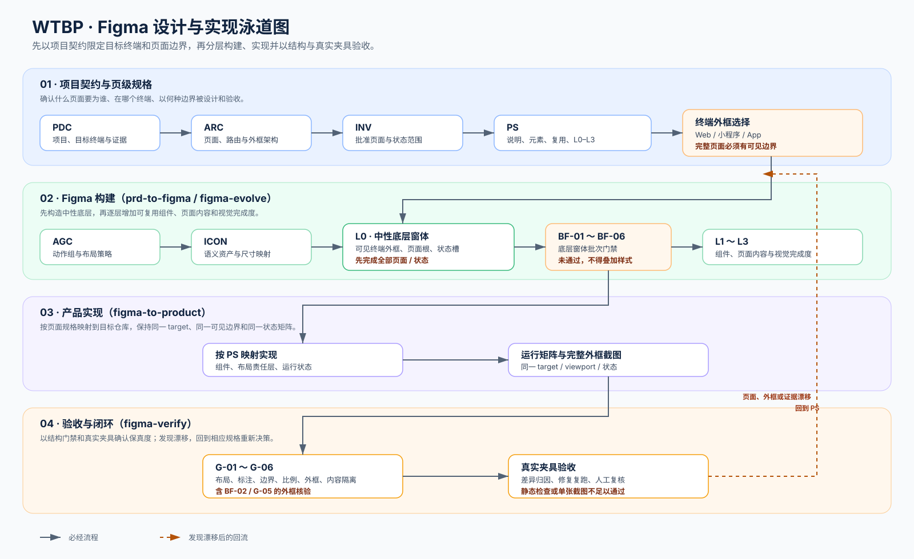

# WTBP — What's The Best Practices

WTBP 是面向软件研发的场景化最佳实践知识库与可复用 Skill 仓库。

它沉淀的不是脱离场景的标准答案，而是可追溯的决策知识：在什么约束下比较哪些方案、
为什么推荐某种方案、如何执行以及如何验证。

## 1. 如何使用

### 查找方案

1. 明确问题场景、约束、风险和需要验证的结果。
2. 从 [`knowledge/catalog.yaml`](knowledge/catalog.yaml) 查找候选 Practice，或调用 [`skills/practice-search`](skills/practice-search/SKILL.md)。
3. 阅读目标 Practice 的适用边界、推荐规则、证据和参考实现。
4. 将最终选择和取舍写入使用方项目的决策记录。

### 执行流程

Practice 负责“如何判断”，Skill 负责“如何执行”。只有稳定、可重复的流程才沉淀为 Skill；
Skill 应引用 Practice，不复制 Practice 的完整内容。

涉及 Figma 时，先阅读 [`docs/figma-skill-architecture.md`](docs/figma-skill-architecture.md)，按创建、演进、
单终端实现和验收选择唯一阶段；不要把四段流程合并为一次操作。



泳道图的门禁定义、终端外框选择和可维护 Mermaid 源码见
[`docs/figma-skill-architecture.md`](docs/figma-skill-architecture.md)。

官方 Figma 能力、Code Connect 与可选第三方审计的采用边界见
[`docs/external-design-capabilities.md`](docs/external-design-capabilities.md)。

### 贡献内容

新增或修改 Practice、Skill、参考实现或评测前，先阅读 [`CONTRIBUTING.md`](CONTRIBUTING.md)。
Skill 必须同时维护对应的 Eval，具体规则见 [`docs/skill-evaluation.md`](docs/skill-evaluation.md)。

## 2. AI 与智能体读取顺序

为快速建立全局认知，按以下顺序读取：

1. [`AGENTS.md`](AGENTS.md)、[`CLAUDE.md`](CLAUDE.md)：AI 使用的英文规范源，定义协作边界、输出契约和授权规则；中文对照见 [`AGENTS.zh-CN.md`](AGENTS.zh-CN.md)、[`CLAUDE.zh-CN.md`](CLAUDE.zh-CN.md)。
2. [`docs/how-to-use.md`](docs/how-to-use.md)：知识库的使用方式和对象关系。
3. [`knowledge/skill-framework.zh-CN.md`](knowledge/skill-framework.zh-CN.md)：Skill 的五层架构、最小契约和 G0–G6 门禁。
4. [`docs/skill-catalog.md`](docs/skill-catalog.md)：面向人类的中文本地 Skill 能力地图；网络优先复用规则见 [`docs/network-first-capability-governance.md`](docs/network-first-capability-governance.md)。
5. [`knowledge/skill-index.yaml`](knowledge/skill-index.yaml)：本地 Skill 的能力、标签、输入输出和副作用规范源；[`knowledge/external-capabilities.yaml`](knowledge/external-capabilities.yaml) 登记外部能力的来源和采用边界。
6. [`knowledge/catalog.yaml`](knowledge/catalog.yaml)：可发现对象索引；[`knowledge/skill-routes.yaml`](knowledge/skill-routes.yaml) 只负责将问题场景路由到本地 Skill 或受控安装路由。
7. 不确定应使用哪个 Skill 时，先运行 `wtbp "<问题>"`；想浏览外部能力时使用 `wtbp external --domain <领域>`，想核对单项能力时使用 `wtbp show <id>`。
8. 只加载目录指向的目标 Practice、证据、参考实现或 Skill；不要一次性读取全部模式和模板。
9. 需要执行流程时，再读取目标 Skill 的英文 `SKILL.md` 及其按需引用的内容；同路径的 `SKILL.zh-CN.md` 是同步中文对照。完整命名约定见 [`docs/document-language-policy.md`](docs/document-language-policy.md)。

## 3. 项目结构

| 目录 | 用途 |
|---|---|
| `docs/` | 概念、使用方式和治理说明 |
| `knowledge/` | Practice、目录、模式和贡献模板 |
| `skills/` | 可执行的检索与工作流 |
| `tooling/` | 仓库校验、内容审查和 Git Hook |
| `.github/` | Issue、PR、CI 和 Dependabot 配置 |

## 4. 本地校验

```bash
make validate          # 校验仓库结构
make validate-skill-evals # 校验 Skill 评测契约
make validate-skill-routes # 校验问题到 Skill 的路由
wtbp "<问题>"          # 输出本地与外部能力候选；当前会话负责最终语义判断
wtbp list --domain design # 按领域浏览能力
wtbp external --domain design # 浏览外部能力及采用边界
wtbp show skill-router   # 查看本地 Skill 或外部能力卡
make commit-checklist  # 执行完整提交清单
make install-hooks     # 启用提交门禁（每个克隆仓库一次）
make review-staged     # 审查暂存内容
```

提交前必须通过 `make commit-checklist`；它会统一执行 `make validate`、内容审查、变更 Skill 或已登记 Eval 资产对应的
`ske` 契约评测、质量门禁和 `VERSION` 检查。详细规则见 [`docs/commit-checklist.md`](docs/commit-checklist.md)。
提交、PR 和 GitHub 治理细节见：

- [`docs/commit-conventions.md`](docs/commit-conventions.md)
- [`docs/github-governance.md`](docs/github-governance.md)

首次使用时运行：

```bash
bash tooling/install-wtbp.sh
```

它只创建两个指向同一 WTBP 仓库的本机入口：命令行 `wtbp`，以及 Codex 中名为 `wtbp`、实际复用
`skills/skill-router` 的唯一 Skill 链接。不会把每个本地 Skill 分别安装到 Codex；新增能力只需登记到
WTBP 的目录、能力索引和路由中，再由该入口按需发现和加载。外部 Skill 只会在命中唯一、已核验且满足受控安装条件的
路由时由当前会话确认后显式安装；规则见 [`docs/skill-routing.md`](docs/skill-routing.md)。

`wtbp` 不会再启动第二个 LLM 会话，也不会把任务内容转发给外部模型。调用它的当前 Agent/Claude 会话同时读取
本地 Skill 能力卡与外部能力卡，先判断直接使用、适配、组合、仅作参考或自建，再按需读取唯一目标 Skill 的 `SKILL.md`。
这样可以保留完整会话上下文，避免重复调用、额外费用和上下文丢失；命令本身负责可解释的候选发现，外部能力卡不会自动安装，
唯一命中的受控外部安装路由仍需由当前会话确认后显式运行 `wtbp install <skill-id>`。
