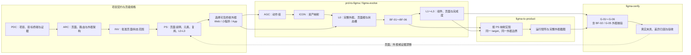

# Figma Skill 架构

WTBP 的 Figma 能力不是单一“大设计 Skill”，而是按责任边界分为四段。选择 Skill 时先确认当前产物
处于哪个阶段；不要把创建、设计演进、代码实现和验收合并为一次操作。

## 统一阶段顺序

```text
PDC 项目契约
  → ARC 整体架构
  → INV 范围清单并获得审批
  → PS 页级规格：页面说明、元素层级、公共组件复用与 L0～L3 计划
  → AGC 动作组契约与 AGC-01～AGC-06
  → ICON 资产清单与 IA-01～IA-07
  → 设计批次与底层窗体（BF-01～BF-06）
  → 组件、状态与页面样式（G-01～G-06）
  → 单一 target 实现
  → 运行证据验收
```

`PDC-03` 可以提前发现项目已有的图标和其他资产，但只能在 `INV` 获批后，按批准页面/状态先建立正式
`PS`，再建立 `AGC` 与 `ICON` 清单。每份 `PS-YYYYMMDD-VNN` 都必须包含：页面说明与范围（`PS-01`）、
完整元素清单与层级（`PS-02`）、公共组件/Token/Icon/资产的复用决策（`PS-03`）、Figma 与代码的 L0～L3
分层实施顺序（`PS-04`），以及设计到代码/验收映射（`PS-05`）。页面样式或代码实现不得跳过它；基础窗体只能
作为 L0，在其通过后才依次加入 L1 公共基础与组件、L2 页面内容与状态、L3 有范围的视觉完成度。`AGC` 先为单一操作、动作组、分段选择与对称导航登记语义、共享组件、宽度/插槽策略、
可见尺寸与触达目标尺寸；例如左右翻页加“本月”的导航必须使用等大的左右插槽，并让中部操作相对父级居中。
模板见 [`knowledge/templates/page-specification-template.zh-CN.md`](../knowledge/templates/page-specification-template.zh-CN.md) 与 [`knowledge/templates/action-group-contract-template.zh-CN.md`](../knowledge/templates/action-group-contract-template.zh-CN.md)。这样不会让资产设计或
页面局部 CSS 反向决定尚未批准的产品范围。

## 终端外框选择

外框不是为了装饰画布，而是让设计、实现和验收共享同一个页面边界。每个页面规格必须根据实际 target 选择并展示框体：

| target | 必须展示 | 不得替代为 |
|---|---|---|
| `web` | 批准的浏览器外框，或边界可见且标明尺寸的视口容器 | 裸画布、通用手机框 |
| `miniapp` | 适用的小程序视口、状态/导航/TabBar 外框 | 通用移动端设备框 |
| `app-ios` / `app-android` | 已声明设备、屏幕尺寸与安全区外壳 | 未声明型号的通用手机框 |

浏览器 Chrome 只有在不属于产品契约时才能省略；无论 target 是什么，完整页面都必须被可见外边界包围。该选择在 `PS-01` 中登记，L0
先构造，`BF-02` 与 `G-05` 共同验收。

## Figma 流程泳道图


上图是可直接查看的泳道图；下方 Mermaid 保留为可维护的源码版本。



## 四段 Skill

| 阶段 | Skill | 负责什么 | 不负责什么 |
|---|---|---|---|
| 从需求开始设计 | `prd-to-figma` | 从 PRD、项目契约和批准清单创建可编辑 Figma 设计 | 代码实现或运行产品验收 |
| 修改已有设计 | `figma-evolve` | 对明确 Figma 节点做 patch，或以 `regenerate` 保留旧版本重做 | 静默覆盖整份文件或实现代码 |
| 设计落地 | `figma-to-product` | 将 Figma 落到一个已声明的 Web、小程序或 App target | 默认实现其他终端 |
| 证据验收 | `figma-verify` | 对比 Figma 与运行实现，定位首个布局责任层 | 仅凭单张截图判定通过 |

四个 Skill 的英文 `SKILL.md` 是 AI 规范源，`SKILL.zh-CN.md` 是同步中文对照；共享规则见
[`knowledge/design-principles.zh-CN.md`](../knowledge/design-principles.zh-CN.md) 与
[`knowledge/design-workflow.zh-CN.md`](../knowledge/design-workflow.zh-CN.md)。

## 外部能力的接入边界

官方 Figma MCP 是默认能力源，Code Connect 是组件到代码映射的优先来源；它们为 WTBP 提供事实和操作能力，
但不替代 WTBP 的项目契约与验收门禁。第三方 Token、WCAG 或设计 lint 能力仅在明确授权后作为补充审计，
不得自动安装、索取 PAT 或代替真实验收。采用清单与授权边界见
[`docs/external-design-capabilities.md`](external-design-capabilities.md)。

## 证据成熟度

当前四个 Figma Skill 均为 `candidate`。仓库校验和 Skill-up dry-run 证明目录、路由、用例与规则可加载，
但不证明真实 Figma 写入、运行产品、像素一致性或人工验收已经完成。

要把某次交付称为完成，必须为该项目保留 Figma 节点、目标终端、视口/设备、状态、确定性数据、失败/预期/修复后截图、
首个布局责任层、改动文件或节点、复跑结果和人工复核。详见 [`docs/skill-evaluation.md`](skill-evaluation.md)。
